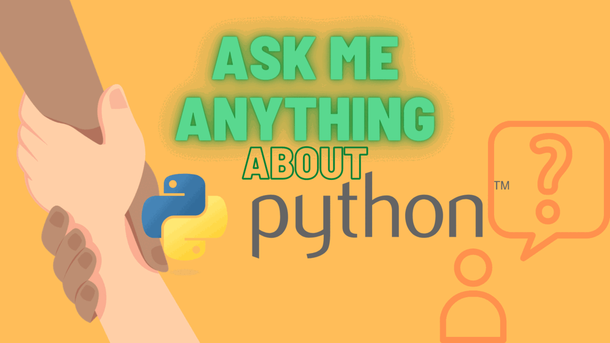

### Hi there 👋

 

<!--
 

 
 

-->

<!--
**Sammeeey/Sammeeey** is a ✨ _special_ ✨ repository because its `README.md` (this file) appears on your GitHub profile.

Here are some ideas to get you started:
-->

- 🔭 I’m currently working on [CoderMatching](https://twitter.com/CoderMatching)
- 🌱 I’m currently learning [Django](https://www.djangoproject.com/)
- 👯 I’m looking to collaborate on [CoderMatching](https://twitter.com/CoderMatching)
- 🤔 I’m looking for collaboration/support/exhange regarding frontend and maybe Django in [CoderMatching](https://twitter.com/CoderMatching)
- 💬 Ask me about Permaculture, Plant Science🌱🧫, Mindfulness & Meditation, Community, Business, Freelancing, Financial Independence
- 📫 How to reach me:
  - [Samuel@SamuelHartmann.de](mailto:samuel@samuelhartmann.de)
  - 🐦Twitter: [CoderMatching](https://twitter.com/CoderMatching)

